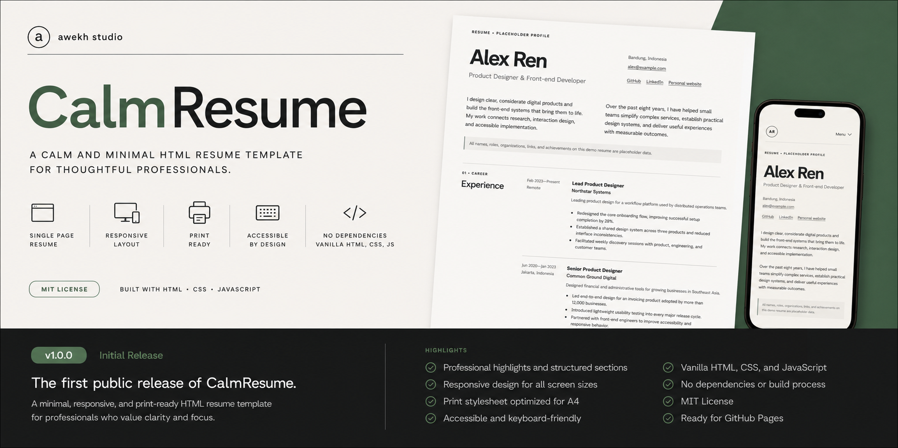

# CalmResume

> A calm and minimal HTML resume template for thoughtful professionals.



## Live demo

[View the live demo](https://awekhstudio.github.io/calmresume/) · [GitHub repository](https://github.com/awekhstudio/calmresume)

## Overview

CalmResume is a quiet, formal, one-page web resume by **awekh studio**. It combines semantic HTML, an editorial responsive layout, and concise print styling. Open it directly, replace the demo content, and publish it without installing anything.

## Features

- Semantic single-page resume
- Responsive editorial layout
- Professional highlights
- Experience section
- Selected projects
- Education
- Grouped skills
- Recognition
- Languages
- Availability details
- Mobile navigation
- Print / Save as PDF
- A4 print stylesheet
- Keyboard-friendly navigation
- Reduced-motion support
- No build process
- No external dependencies

## Preview

Final screenshots should use these names:

- `preview/calmresume-desktop.jpg`
- `preview/calmresume-mobile.jpg`
- `preview/calmresume-print.jpg`

They are not embedded until the release screenshots are added, so this README remains free of broken images. Capture requirements are documented in [preview/README.md](preview/README.md).

## Tech stack

- HTML5
- CSS3
- Vanilla JavaScript

There are no frameworks, libraries, package managers, build tools, external fonts, icon libraries, backends, CMS integrations, or external runtime requests.

## Getting started

### Download

1. Download the repository ZIP from GitHub.
2. Extract it.
3. Open `index.html` in a modern browser.

### Clone with Git

```sh
git clone https://github.com/awekhstudio/calmresume.git
cd calmresume
```

Then open `index.html`. No install or build command is required.

## Project structure

```text
calmresume/
├── .github/
│   ├── ISSUE_TEMPLATE/
│   │   ├── bug_report.md
│   │   └── feature_request.md
│   └── pull_request_template.md
├── assets/
│   ├── css/
│   │   ├── reset.css
│   │   └── style.css
│   ├── icons/
│   │   └── favicon.svg
│   ├── images/
│   │   └── .gitkeep
│   └── js/
│       └── main.js
├── preview/
│   └── README.md
├── .editorconfig
├── .gitignore
├── 404.html
├── CHANGELOG.md
├── CONTRIBUTING.md
├── index.html
├── LICENSE
├── README.md
├── RELEASE_NOTES.md
├── robots.txt
├── SECURITY.md
└── sitemap.xml
```

The four final JPEG previews are intentionally pending; their required names are listed in `preview/README.md`.

## Customization

The resume content lives in `index.html`. Replace the following demo values:

- Name, professional title, location, and email
- GitHub, LinkedIn, personal website, and project URLs
- Profile summary and professional highlights
- Experience and achievements
- Projects, education, and grouped skills
- Recognition and languages
- Availability, references, and copyright

Keep the existing heading order, section labels, semantic elements, and valid `datetime` values where possible. If a section ID changes, update its navigation link too.

Design tokens live in the `:root` block in `assets/css/style.css`. Adjust colors, spacing, container width, and related visual properties there. Print-specific styling is under `@media print`.

## Resume content guide

Write concise, verifiable content. Use action-oriented achievement bullets, include useful outcomes without inflating statistics, and keep date and location formats consistent. Skills are grouped as text rather than ratings. Remove sections that do not support your application, then check navigation and print pagination again.

### Placeholder data notice

**Alex Ren is a fictional demo persona.** Every organization, achievement, statistic, link, award, and professional detail in the template is placeholder content. Replace all of it before publishing or sharing your resume.

## Print and PDF

1. Open the resume in a modern browser.
2. Select **Print PDF**.
3. Choose A4 paper.
4. Use 100% scale.
5. Use the stylesheet margins when the browser supports them.
6. Select **Save as PDF**.

The print stylesheet targets a maximum of two A4 pages. Pagination may vary slightly with the browser, system font, printer, locale, and replacement content, so review the preview before saving.

## Deployment

### GitHub Pages

Open **Settings → Pages**, choose **Deploy from a branch**, select `main` and `/ (root)`, then save.

### Netlify or Cloudflare Pages

Import the repository as a static site. Use the repository root as the publish directory and leave build commands empty.

### Shared hosting

Upload the repository contents to the public web directory. Keep the relative paths intact.

## Accessibility

CalmResume includes semantic landmarks, logical headings, a skip link, labeled navigation, clear `:focus-visible` states, keyboard-operable controls, and reduced-motion support. Recheck contrast, link labels, reading order, and keyboard behavior after customization.

## Browser support

CalmResume targets current versions of Chrome, Edge, Firefox, and Safari. Internet Explorer is not supported.

## Roadmap

- [x] Responsive layout
- [x] Print stylesheet
- [x] Accessibility foundations
- [x] Repository documentation
- [ ] Additional resume content examples
- [ ] Optional alternate layout
- [ ] Community feedback improvements

## Contributing

Read [CONTRIBUTING.md](CONTRIBUTING.md) before opening an issue or pull request.

## Security

Read [SECURITY.md](SECURITY.md). Do not disclose sensitive personal information in public issues.

## License

CalmResume is available under the [MIT License](LICENSE).

## Credits

CalmResume is designed and maintained by [awekh studio](https://github.com/awekhstudio).
